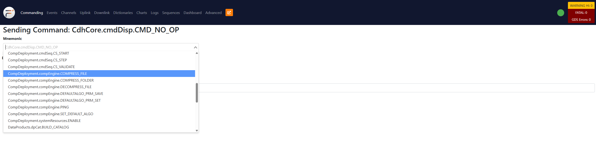
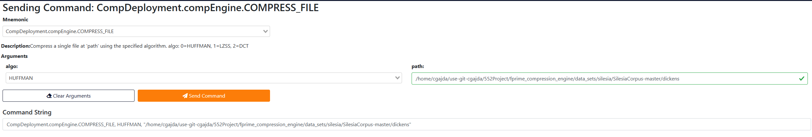
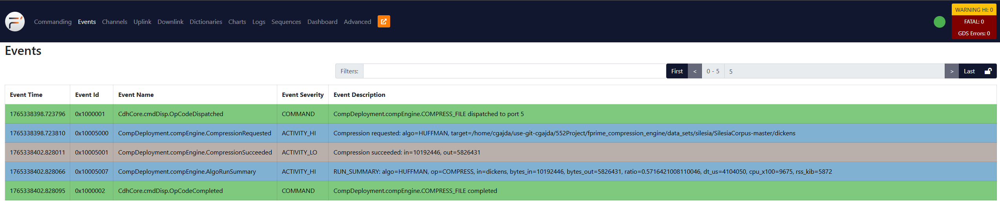
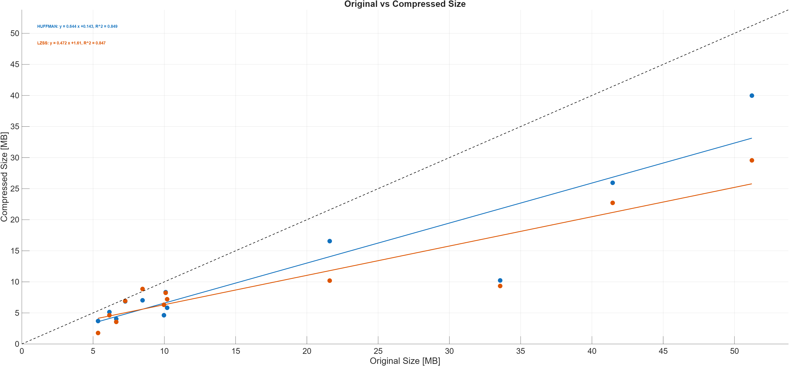

<p align="center">
# 
</p>

# F´ Compression Engine  
*A modular lossless + lossy compression library integrated into NASA JPL’s F´ flight software framework.*

---

## Overview

Small spacecraft, CubeSats, and embedded robotic systems often operate under severe downlink and storage constraints.  
This repository provides a unified, flight-software-safe compression engine that integrates directly into the **F Prime (F´)** framework and enables onboard reduction of telemetry, logs, and imagery.

This engine implements:

### Lossless Algorithms
- **Huffman Coding** — entropy-based, optimal prefix-free code.
- **LZSS** — dictionary-based sliding-window compressor.

### Lossy Algorithm
- **DCT-Based JPEG Compressor** — converts input images into compressed `.jpg` files.

The algorithms are written in C++, wrapped in an F´ component, and tested on a **Raspberry Pi 5**.

## Getting Started with F´

If you're new to F Prime, begin here:

- F´ Tutorial: https://fprime.jpl.nasa.gov/docs/UsersGuide/first-project/
- Installation Guide: https://fprime.jpl.nasa.gov/docs/Installation/installation/
- CLI Reference: https://fprime.jpl.nasa.gov/docs/UsersGuide/cli/

This project assumes you can build and run an F´ deployment.

---

## Building the Compression Engine and Commanding for COmpression

From the project root (same folder holding the _compress_ directory):

### 1. Generate the build tree
```bash
fprime-util generate
```

### 2. Build the project
```bash
fprime-util build
```
### 3. Run the Ground Data System
```bash
fprime-gds
```
### 5. Web browser opens automatically
Ensure you get the "green bubble of hope" and not the "red X of death". Enter the commanding tab at the topbar and select the compression command from the dropdown.
# 

### 6. Enter the desired algorithm and filepath, then send command
# 

### 7. Verify command success in the events tab
# 

### 8. Extract the logfile either from the gui (copy paste) or in the logs stored on the machine running the deployment.
# 

### 9. Write the log out to a csv file, run the MATLAB script in the parent directory, and observe your data!
# 


